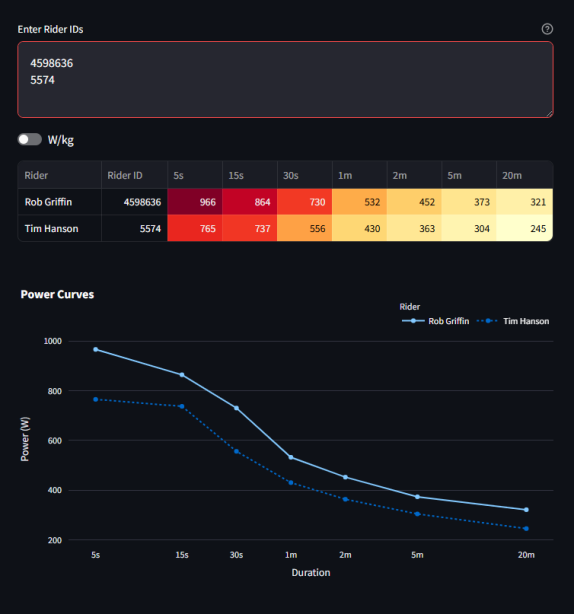

# ZwiftRacing.app API

> ZwiftRacing is a cutting-edge web application designed for avid cyclists and competitive racing enthusiasts who use Zwift, the popular online cycling platform. With ZwiftRacing (ZR), you can take your virtual cycling experience to the next level by participating in organized races using the first result-based categorization system ever made for indoor cycling. &mdash; [zwiftracing.app](https://www.zwiftracing.app/docs)


### ZRapp API

ZwiftRacing.app also has an API providing endpoints that allow users to programmatically fetch ZRapp data. This includes data on riders, clubs and events. The API is hosted at [https://zwift-ranking.herokuapp.com/public/](https://zwift-ranking.herokuapp.com/public/). You may encounter another ZRapp API address &mdash; please don't use that one, it is used by the ZwiftRacing.app and needs to be kept free from unnecessary traffic!

To get access to the ZRapp API, you first need to join the ZRapp Discord server, then send Tim Hanson a message to request access to the API. Tim can then give you an API key. Store this key in a ``.env`` file in the root directory of your project or, if using streamlit, in `.streamlit/secrets.toml`. Note that my code is all written for use with Streamlit so, if using ``.env``, you will need to switch those parts out accordingly (from calling ``st.secrets['api']['key']`` to ``os.getenv('key')``).

**Be careful to add the ``.env`` and/or ``.streamlit/secrets.toml`` paths to your ``.gitignore`` file if using Git. Do not share the API key &mdash; it is yours and should be handled with respsect.**

- ``.gitignore``

    ```
    .env
    .streamlit/secrets.toml
    ```

- ``.env``

    ```
    key=myapikey12345
    ```

- ``./.streamlit/secrets.toml``

    ```{yaml}
    [api]
    key="myapikey12345"
    ```


### Endpoints

|Endpoint|Type|Description|
|-----|-----|-----|
|``/riders/<id>``|``Get``|Returns details about a rider.|
|``/riders/<id>/<time>``|``Get``|Returns details about a rider at a specific point in time.|
|``/riders``|``Post``|Returns rider details for a list of riders. List is sent as the body of the request.|
|``/clubs/<id>``|``Get``|Returns details for a club, including (up to) 1000 active riders.|
|``/clubs/<id>/<riderId>``|``Get``|Returns details for a club, including (up to) 1000 active riders, starting from a given rider - rider data is stored in order of ascending ``riderId``.|
|``/results/<id>``|``Get``|Returns details for an event.|

You can find my functions to query each ``GET`` endpoint, plus a function combining ``/clubs/<id>`` and ``/clubs/<id>/<riderId>`` to get *all* riders in a club, in [``zrapp/endpoints.py``](https://github.com/robgriffin247/zrapp_demo/blob/main/zrapp/endpoints.py). The function for the ``POST`` request to ``riders`` is on its way.


## Demos

### Get data from ZRapp API

[This demonstrates](https://github.com/robgriffin247/zrapp_demo/blob/main/demos/request_demo.py) the use of the ZRapp API to get the data for a specific rider, given by rider ID. It returns a dictionary of data including rider ID, descriptive data (name, weight, height, country), power data and ZRapp phenotype data.

### Load data using DLT

[DLT](https://dlthub.com/docs/intro) eases the process of transforming nested json files into tables. DLT automatically unnests the data into suitable tables and loads them into a duckdb database. [This demo](https://github.com/robgriffin247/zrapp_demo/blob/main/demos/dlt_demo.py) shows how DLT can be used to unpack the nested json data received from a request to get all club riders.


### Transform data with DuckDB

Once data is staged to the local DuckDB database, the `duckdb` module can be used to query the database with SQL. [This demonstrates](https://github.com/robgriffin247/zrapp_demo/blob/main/demos/duckdb_demo.py) how to get data in and out of duckdb and do some SQL based transformations.


### Visualise data with Streamlit

Streamlit is a tool that can be used to create webapps. [This demo](https://github.com/robgriffin247/zrapp_demo/blob/main/streamlit_demo.py) collects data for given rider IDs, creates a table of power data and plots power curves for the riders included. Run the app with ``streamlit run streamlit_demo.py``.




